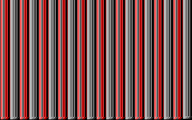

# PC INTRO demo

## Content
1. 32b PC INTRO
    * m30
    [Source](32b/m30.asm)

2. 256b PC INTRO
    * fire256b
    [Source](256b/fire.asm)
    [Video](https://youtu.be/oFza4WA_P8I)

## Binaries
All binaries are in the "bin" folder of this repository.

## Requirements:
* [DOSBox][1]
* Assembler

# AUTHOR
   An0ther0ne

[1]: https://www.dosbox.com/ "DOSBox offisial site."
