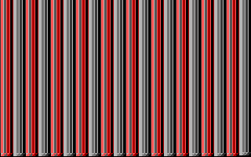

# PC INTRO demo

## Content
### 32b PC INTRO
* m28
    * Size: 28 bytes
    * [Binary](bin/m28.com)
    * [Source](32b/m28.asm)
    * [Video](https://youtu.be/QZiZrmliNeU)
* m28l (variant)
    * Size: 28 bytes
    * [Binary](bin/m28l.com)
    * [Source](32b/m28l.asm)
    * [Video](https://youtu.be/m0Jq4N_2yBM)
* serpin28
    * Size: 28 bytes
    * [Source](32b/serpin28.asm)
    * [Binary](bin/serpin28.com)
    * [Video](https://youtu.be/Rqpn4422YCM)
* kasp16
    * Based on [kasparov](https://www.pouet.net/prod.php?which=75912) from HellMood, DESiRE, 4/2018
    * Size 16 bytes
    * [Binary](bin/kasp16.com)
    * [Source](32b/kasp16.asm)
    * [Video](https://youtu.be/7i_TjmrMbgM)
* kasp21
    * Size: 21 bytes
    * [Binary](bin/kasp21.com)
    * [Source](32b/kasp21.asm)
    * [Video](https://youtu.be/LIjHiCPjCVk)
* kasp26
    * Size: 26 bytes
    * [Binary](bin/kasp26.com)
    * [Source](32b/kasp26.asm)
    * [Video](https://youtu.be/OnyckFqjP_U)
### 256b PC INTRO
* fire253
    * Size: 253 bytes
    * [Binary](bin/fire253.com)
    * [Source](256b/fire253.asm)
    * [Video](https://youtu.be/oFza4WA_P8I)

## All in one archived
[7zip](zip/An0ther0ne_INTRO.7z)

## Requirements:
* [DOSBox][1]
* Assembly language

# AUTHOR
   An0ther0ne

## THANKS
* **HellMood**
* Special great thanks to **Jin X'onik**

[1]: https://www.dosbox.com/ "DOSBox offisial site."
