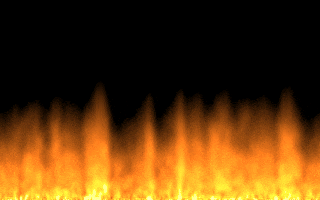

# PC INTRO demo

## Content
### 32b PC INTRO
* m30
    * Size: 30 bytes
    * [Binary](bin/m30.com)
    * [Source](32b/m30.asm)
    * [Video](https://youtu.be/QZiZrmliNeU)
* serpin29
    * Size: 29 bytes
    * [Source](32b/serpin29.asm)
    * [Binary](bin/serpin29.com)
    * [Video](https://youtu.be/Rqpn4422YCM)
* kasp16
    * Based on [kasparov](https://www.pouet.net/prod.php?which=75912) from HellMood, DESiRE, 4/2018
    * Size 16 bytes
    * [Binary](bin/kasp16.com)
    * [Source](32b/kasp16.asm)
    * [Video](https://youtu.be/7i_TjmrMbgM)
* kasp21
    * Size: 21 bytes
    * [Binary](bin/kasp21.com)
    * [Source](32b/kasp21.asm)
    * [Video](https://youtu.be/LIjHiCPjCVk)
* kasp26
    * Size: 26 bytes
    * [Binary](bin/kasp26.com)
    * [Source](32b/kasp26.asm)
    * [Video](https://youtu.be/OnyckFqjP_U)
### 256b PC INTRO
* fire253
    * Size: 253 bytes
    * [Binary](bin/fire253.com)
    * [Source](256b/fire253.asm)
    * [Video](https://youtu.be/oFza4WA_P8I)

## All in one archived
[7zip](zip/An0ther0ne_INTRO.7z)

## Requirements:
* [DOSBox][1]
* Assembly language

# AUTHOR
   An0ther0ne

[1]: https://www.dosbox.com/ "DOSBox offisial site."
